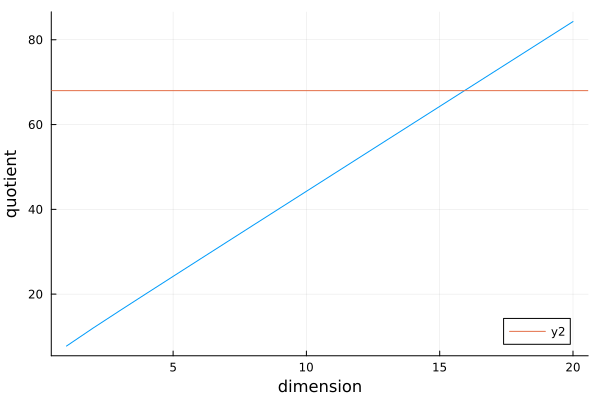

# Introduction
The code found in this repository implements the conjugate gradient Method for the specific case of the laplace operator $\triangle$ with dirichlet boundary conditions, where without loss of generality the value of the solution was fixed to $0$ at the boundary of the square domain. It is an iterative method used for solving large systems of equations of the form
$$
Ax = b
$$
where $A$ is positive semi definite for the vector $x$. 

To understand the conjugate gradient method let us consider the function
$$
f(\mathbf{x})=\frac{1}{2} \mathbf{x}^{\top} \mathbf{A} \mathbf{x}-\mathbf{x}^{\top} \mathbf{b}, \quad \mathbf{x} \in \mathbf{R}^n
$$
we note that the derivative of $f$ is
$$
\nabla f(\mathbf{x})=\mathbf{A} \mathbf{x}-\mathbf{b}
$$
so therefore finding an extremum of $f$ is at ${} x_{m} {}$ equivalent to $\nabla f(x_{m})=0$ which solves the problem.

Because of numerical precision however the point that $\nabla f = 0$ might never be reached. Therefore we have to find the minimal value for $\nabla f$ so that $\nabla f \approx 0$. We call this the residual $r_{j} = -\nabla f = b-Ax_{j}$. 

In order to do this, we start with an initial guess $x_{0}$. Using this initial guess we follow the gradient $p_{0} = b-Ax_{0}$ until a minimum is found along the gradient. If the result residual $r$ is too large, we follow along a direction that is $A$-Othogonal to $p_{0}$.

The normal gradient method would now require a move along the residual $r_{k}$, because it is the negative of the gradient. However it is more effective to demand that the next search direction $p_{k}$ should be A-orthogonal to all previous search directions ($p_{j} A p_{k} = 0$) in order to not go into the same direction twice. This constraint can be solved by the gram schmitt algorythm:
$$
\mathbf{p}_k=\mathbf{r}_k-\sum_{i<k} \frac{\mathbf{p}_i^{\top} \mathbf{A} \mathbf{r}_k}{\mathbf{p}_i^{\top} \mathbf{A} \mathbf{p}_i} \mathbf{p}_i
$$
Now we follow this direction a distance $\alpha_{k}$, which minimizes $f$ along that direction. Therefore
$$
\alpha_k=\frac{\mathbf{p}_k^{\top}\left(\mathbf{b}-\mathbf{A} \mathbf{x}_k\right)}{\mathbf{p}_k^{\top} \mathbf{A} \mathbf{p}_k}=\frac{\mathbf{p}_k^{\top} \mathbf{r}_k}{\mathbf{p}_k^{\top} \mathbf{A} \mathbf{p}_k}
$$
with $\mathbf{x}_{k+1}=\mathbf{x}_k+\alpha_k \mathbf{p}_k$.

So the full conjugate gradient method is given by:

$$
\begin{align}
d_{(0)}&=r_{(0)}=b-A x_{(0)} \\
\alpha_{(i)}&=\frac{r_{(i)}^T r_{(i)}}{d_{(i)}^T A d_{(i)}} \\
x_{(i+1)}&=x_{(i)}+\alpha_{(i)} d_{(i)} \\
r_{(i+1)}&=r_{(i)}-\alpha_{(i)} A d_{(i)} \\
\beta_{(i+1)}&=\frac{r_{(i+1)}^T r_{(i+1)}}{r_{(i)}^T r_{(i)}} \\
d_{(i+1)}&=r_{(i+1)}+\beta_{(i+1)} d_{(i)}
\end{align}
$$
The matrix $A$ used here in this specific case is the coarse laplace operator 
$$
\triangle =  \begin{pmatrix}
& 2 & -1 \\
 & -1  & 2  & -1 \\
 &  & -1  & 2 & -1 \\
 &  &  &  & \dots
\end{pmatrix}
$$


## Preconditioned CG
As shown in the Book "Conjugate gradient methods without the agonizing pain", the error at every iteration $e_{i} = x_{m} - x_{i}$ is bounded by:

$$
\left\|e_{(i)}\right\|_A \leq 2\left(\frac{\sqrt{\kappa}-1}{\sqrt{\kappa}+1}\right)^i\left\|e_{(0)}\right\|_A
$$
where $\kappa$ is the conditioning number of $A$. This shows $k=\frac{1}{2} \sqrt{\kappa(\mathbf{A})} \log \left(\left\|\mathbf{e}_0\right\|_{\mathbf{A}} \varepsilon^{-1}\right)$ iterations suffices to reduce the error to $2 \varepsilon$ for any $\varepsilon>0$.

The idea behind preconditioened GC is then to solve $Ax = b$ indirectly by solving
$$
M^{-1} A x=M^{-1} b
$$
where the conditioning number of $M^{-1}A$ is lower than the conditioning number of $A$. 
This results in the preconditioned cg or transformed conjugate gradient mehtod:
$$
\begin{aligned}
r_{(0)}&=b-A x_{(0)} \\ 
d_{(0)}&=M^{-1} r_{(0)} \\
 \alpha_{(i)}  &=\frac{r_{(i)}^T M^{-1} r_{(i)}}{d_{(i)}^T A d_{(i)}} \\
 x_{(i+1)} &=x_{(i)}+\alpha_{(i)} d_{(i)} \\
 r_{(i+1)} &=r_{(i)}-\alpha_{(i)} A d_{(i)} \\
 \beta_{(i+1)} &=\frac{r_{(i+1)}^T M^{-1} r_{(i+1)}}{r_{(i)}^T M^{-1} r_{(i)}} \\
 d_{(i+1)} &=M^{-1} r_{(i+1)}+\beta_{(i+1)} d_{(i)}
 \end{aligned}
 $$
where we have to calculate $M^{-1}$.
In this repository however we want to take advantage of the speed provided by modern graphics cards that use single precision floats. Therefore we implemented a floating point version of the cg on gpu as a preconditioner for the cg on the cpu that uses double precision.


# Implementation
Here some implementation details are described. 

## Reduction
For the implementation of the reduction that needs to be done for the inner product, I refered to the document "Optimizing Parallel Reduction in CUDA" by Mark Harris. It uses sequential adressing, see figure below:
![[Pasted image 20240904205146.png]]

This is the code that is used for this:
```cpp
__global__ void reduceMulAddComplete(float *v, float *w, float *g_odata,
                                            unsigned int n,const unsigned int nthreads)
{
  // set thread ID
  unsigned int tid = threadIdx.x;
  unsigned int gridSize = blockDim.x * 2 * gridDim.x;
  unsigned int idx = blockIdx.x * blockDim.x * 2 + threadIdx.x;

  // shared memory is per block
  extern __shared__ float tmp[]; // shared memory can be given as 3rd argument to allocate it dynamicially

  // unroll as many as possible
  float sum = 0.0;
  int i = idx;
  while (i < n)
  {
    sum += v[i]* w[i] + v[i + blockDim.x]* w[i + blockDim.x];
    i += gridSize;
  }
  // g_idata[idx] = sum;
  tmp[tid] = sum;

  __syncthreads();

  // in-place reduction in shared memory
  for (int stride = blockDim.x / 2; stride > 0; stride /= 2)
  {
    if (tid < stride)
    {
      tmp[tid] += tmp[tid + stride];
    }

    // synchronize within threadblock
    __syncthreads();
  }

  // atomicAdd result of all blocks to global mem
  if (tid == 0)
    atomicAdd(g_odata, tmp[0]);
}
```

Note that for the final addition, the library function aromicAdd is used. The `atomicAdd` function is performed atomicially, which means that it is compleated in one single uniteruptable step. This guarantees that no other thread can access the variable, before the operation is complete. This ensures that the values are added sequentially for each block.

This function can then be called using `reduceMulAddComplete<<<nblocks, nthreads, nthreads*sizeof(float)>>>(v, w, bs, N, nthreads);`, where the third parameter in the launch configuration is the size of the shared memory that is allocated.

## Julia C call interface
To call a c function from julia it can be wrapped inside of a julia function. 
For example to call the c function 
```c++
extern "C" float conjugate_gradient_gpu(float * b, float * x , int L, int d);
```
We have to compile a shared object file. Using cmake this is done with the `add_library(conjugate_gradient_gpu SHARED file.cu)` command.
Then we can load this shared library using julia: `lib = Libdl.dlopen("./build/libconjugate_gradient_gpu.so")`. Now we can call c functions from julia.
We can wrap it inside a julia function for convenience:
```jl
# Define the wrapper function for `conjugate_gradient_gpu`
function conjugate_gradient_gpu(b::CuArray{Float32}, x::CuArray{Float32}, L, d)::Cfloat
    sym = Libdl.dlsym(lib, :conjugate_gradient_gpu)
    @ccall $sym(get_ptr(b)::CuPtr{Cfloat}, get_ptr(x)::CuPtr{Cfloat}, L::Cint, d::Cint)::Cfloat
end
```

then we can use `unsafe_convert` to get a pointer to a cuda array. 

```jl
function get_ptr(A)
    return Base.unsafe_convert(CuPtr{Cfloat}, A)
end
```

This allows us to use all the functionality from julia such as plotting, generating random arrays, interactivity etc. We can even define test sets:
```jl
julia> @testset "indexing on GPU" begin
           @test neighbour_index_gpu(2,1,1,3,2,9,0) == 5
           # edges
           @test neighbour_index_gpu(2,0,1,3,2,9,0) == 9
           @test neighbour_index_gpu(3,0,-1,3,2,9,0) == 9
       end;
Test Summary:   | Pass  Total  Time
indexing on GPU |    3      3  0.1s
```

However in this code I implemented the tests in cpp.
## Methods for Indexing
There are currently two methods implemented for calculating the position of a certain value in memory given its index, as well as calculating adjacent indecies. 

### Normal indexing method
Given an $L \times L \times \dots \times L$ array $V$ of dimension $d$, the index $i$ can be calculated from a set of coordinates $\{ c_{1}\dots c_{d} \}$ ${} c_{k}\in \mathbb{N}_{0} {}$ the following way:
$$
i = \sum_{k=0}^{k<d}L^{k} c_{i}
$$
Additionally we would like to fix the dirichlet boundary condition that the solution fullfills $f(x_{b})=0$ for $x_{b} \in \partial V$ on the boundary. In order to save space and make implementation more efficient, in the implementation the array $V$ is actually smaller and all the points on the boundary of $V$ are all combined in a single value stored beyond the last index at the position $N=L^{d}$. In the (a bit slower, but more readable) cpu implementation this looks like this:

```cpp
int get_index(int *cords, int L, int d, int N) {
  for (int c = 0; c < d; c++) {
    int cord = cords[c];
    assert(cord < L + 1 && cord > -2);
    if (cord == -1 || cord == L) {
      return N;
    }
  }

  int ind = 0;
  for (int i = 0; i < d; i++) {
    ind += pow(L, i) * cords[i];
  }
  return ind;
}
```

However for calculating the laplacian, we can skip this conversion step. We never need to calculate the index for a given coordinate, we just need to calculate the neighbouring index of a given index $i$. For this we need to add or subtract $L^{k}$ where $k$ is the direction we want to know the neighbouring index. Therefore the conversion of coordinate to index and back can be skipped alltogether, which is done in the gpu implementation of the laplace operator.

```cpp
__global__ void laplace_gpu(float *ddf, float *u, int d,
                                   int L, int N, unsigned int index_mode)
{
  int ind = blockIdx.x * blockDim.x + threadIdx.x;
  if (ind < N)
  {
    float laplace_value = 0;
    for (int i = 0; i < d; i++)
    {
      laplace_value += - u[neighbour_index_gpu(ind, i, 1, L, d, N, index_mode)]
                       + 2 * u[neighbour_index_gpu(ind, i, 0, L, d, N, index_mode)]
                       - u[neighbour_index_gpu(ind, i, -1, L, d, N, index_mode)];
    }
    ddf[ind] = laplace_value;
  }
}
```

One can either choose to precaculate a lookup table for all neighbouring indecies with a given index, or calculate the neighbouring index every time. I chose to reacalculate the neighbour index every time, because I expected the algorythm to be memory bound rather than beeing compute bound and the additional space can be used for computing larger systems and getting a better resolution/better approximation of the continous laplace operator.

### Advanced indexing with bit operations
With this naiive way of indexing however a problem arrises. The memory access pattern along the $0^{th}$ index is sequential and thus can make use of coalesced memory access. However for the other directions this is not the case. Additionally the cache locality is not great, because the values accessed in the other directions are only accessed again, if the algorythm is allready processing the next row. So in order to improve cache locality the idea is that the traversal of the domain is done differently. 

The idea is that if nearby sites are accessed at the same time, the values are likely allready in the cache. Therefore, rather then assigning threads linearly, they are assigned in a fractal-like zig zag pattern.
This is done by storing the $x_{i}$ coordinate inside of a single integer $n$ together with all other coordinates. 

For a 2d system for example, every second bit of the mixed coordinate long integer is for the second coordinate and every first bit for the first coordinate. Then for traversing the grid, you simply add $1$ to $n$. Because of the overflow the $x$ and $y$ coordinates are increased in an alternating fashion. The `pdep` and `pext` function allows to encode and decode bits. They take two inputs, an integer and a mask. For `pdep` the integer is seen as a list of bits and the mask gets applied to it. The bits get scattered along the output integer corresponding to the positions in the mask. For `pext` they are extracted from the input integer according to the mask and gathered together. 

## Managed Memory
For the arrays on the GPU I am using managed memory, which hands the responsibility of copying the arrays over to the driver and allows to access the arrays from the gpu host code as well, which is useful for debugging.

# Scaling
Let us look at the code for the laplace operator and count the number of read and write operations and float and iteger operations. This should give us an idea if the code is compute or memory bound.
The function that computes the coordinate of a given index looks like this:

```c++
static inline __device__ __host__ int index_to_cords(int index, int L, int d)
{
  for (int i = 0; i < d; i++)
  {
    index /= L;
  }
  return index % L;
}
```
it does `d` divisions and one modulo operation. 
In assembly it looks like this (using https://godbolt.org/ and compiling with -O3 on gcc 14.2 x86-64):

```
index_to_cords(int, int, int):
        mov     eax, edi
        mov     edi, edx
        test    edx, edx
        jle     .L2
        xor     ecx, ecx
.L3:
        cdq
        add     ecx, 1
        idiv    esi
        cmp     edi, ecx
        jne     .L3
.L2:
        cdq
        idiv    esi
        mov     eax, edx
        ret
```
for the remainder of this analysis I assume that the general structure of the assembly code (number of integer/float/read/write operations) is the same for cpu and gpu code.
Where `idiv` are integer divisions. The `idev` instruction computes the division and the remainder, so `mov     eax, edx` stores the quotient in `eax` and the remainder in `edx`. There is no read or write from the main memory in this code, because `eax`, `edi` etc. are registers on the cpu. 

So in total we have 

1. `test    edx, edx`    → Logical AND (1 integer operation)
2. `xor     ecx, ecx`    → Logical XOR (1 integer operation)
3. `cdq`                → Sign extend (1 integer operation in `.L3`)
4. `add     ecx, 1`      → Addition (1 integer operation)
5. `idiv    esi`         → Integer division (1 integer operation in `.L3`)
6. `cmp     edi, ecx`    → Compare (1 integer operation)
7. `cdq`                → Sign extend (1 integer operation in `.L2`)
8. `idiv    esi`         → Integer division (1 integer operation in `.L2`)

which gives 4 operations in .L3, 2 in .L2 which is 6 operations per itteration of the loop and 2 operations outside. Giving us $8d + 2$ operations in total.


The next function we need to look at is the neighbour index function:
```cpp
extern "C" __host__ __device__ int neighbour_index_gpu(int ind, int direction,
                                                       int amount, int L, int d,
                                                       int N, int index_mode)
{
  // should be consistant with cpu code
  int cord = index_to_cords(ind, L, direction);
  cord += amount;
  if (/*cord > L || cord < 0 ||*/ cord == -1 || cord == L)
    return N;

  // if on boundary => return 0 through special index
  assert(amount == 1 || amount == -1 || amount == 0);
  int n = 1;
  for (int i = 0; i < direction; i++)
  {
    n *= L;
  }
  ind += amount * n;

  return ind;
}
```

ignoring the boundary checking, which should only relevant for a small part of the domain, we get:
```cpp
int neighbour_index_gpu(int ind, int direction,
                                                       int amount, int L, int d,
                                                       int N, int index_mode)
{
  // should be consistant with cpu code
  int cord = index_to_cords(ind, L, direction);
  cord += amount;
  int n = 1;
  for (int i = 0; i < direction; i++)
  {
    n *= L;
  }
  ind += amount * n;
  return ind;
}
```

which is this assembly code 
```asm
neighbour_index_gpu(int, int, int, int, int, int, int):
        test    esi, esi        ; Logical AND (integer operation)
        jle     .L7             ; Jump
        xor     r9d, r9d        ; Clear r9d (integer operation)
        mov     r8d, 1          ; Move
        test    sil, 1          ; Logical AND (integer operation)
        je      .L8             ; Jump
        mov     r8d, ecx        ; Move
        mov     r9d, 1          ; Move
        cmp     esi, 1          ; Compare (integer operation)
        je      .L15            ; Jump
.L8:
        imul    r8d, ecx        ; Integer multiplication (integer operation)
        add     r9d, 2          ; Addition (integer operation)
        imul    r8d, ecx        ; Integer multiplication (integer operation)
        cmp     esi, r9d        ; Compare (integer operation)
        jne     .L8             ; Jump
.L15:
        imul    edx, r8d        ; Integer multiplication (integer operation)
.L7:
        lea     eax, [rdi+rdx]  ; Address calculation (integer operation)
        ret                     ; Return
```

which gives us 4 operations inside .L8, 1 operation in .L15 and and 1 operation in L7.

I think that L8 is executed `direction` times and the others once, which gives us `4*direction+2+4` operations.

So in total in these two functions there are `12 direction + 8` operations.

```cpp
__global__ void laplace_gpu(float *ddf, float *u, int d, int L, int N,
                            unsigned int index_mode)
{
  int ind = blockIdx.x * blockDim.x + threadIdx.x; // 1 fused ioperation
  if (ind < N) // 1 iop
  {
    float laplace_value = 0;
    for (int i = 0; i < d; i++) // loop d times, 2 iops
    {
      laplace_value += -u[neighbour_index_gpu(ind, i, 1, L, d, N, index_mode)] + 2 * u[neighbour_index_gpu(ind, i, 0, L, d, N, index_mode)] - u[neighbour_index_gpu(ind, i, -1, L, d, N, index_mode)]; // 4 * (12d+8) iops + 3 flops + 3 reads
    }
    // the discrete version is defined without dx
    ddf[ind] = laplace_value; // 1 write
  }
}
```

in order to be able to compile it with gcc I slightly change the function signature to `void laplace_gpu(float *ddf, float *u, int d, int L, int N, unsigned int index_mode, int ind)`. This gives a rather long assembly code which can be found in `figs/C++-x86-64 gcc 14.2-1.asm`.

Based on the line by line analysis of the code, this gives in total
$$
\begin{align}
	2+ d(2+4+12d+8)  & = 2+ 14d+ 12d^2  \qquad & \text{integer operations} \\
 3d  &  & \text{floating point operations} \\
3d &  & \text{reads} \\
1 &  & \text{write}
\end{align}
$$

## Information on the Used device and theoretical upper limit of performance
For estimating the ideal performance, we can look at the [datasheet provided by nvidia](https://www.nvidia.com/content/dam/en-zz/Solutions/design-visualization/quadro-product-literature/quadro-rtx-4000-datasheet.pdf) which notes a single precision performance of 7.1 TFLOPs and memory bandwidth of 416 GB/s.

with a 32 bit performance this gives a ratio of 
```
(32 × (7.1 terabits/second)) / (416 gigabytes/second) ≈ 68
```
from the above code analysis we can see that each itteration does
$$
\frac{(2+14d + 12d^2 + 3d)\text{operations}}{(3d+1)\text{writes}}
$$

therefore the dimension vs quotient analysis looks like this


which suggests that this approach is memory bound for dimensions lower than 15 and compute bound for larger than 15.


# Compiling and Running the test suite
For building, I use cmake. Therefore you have to run
```bash
mkdir build # if it does not exist yet
cd build
cmake ../src
make
```
then you  can either run `./tests` or `./main`.
some additional, interactive functionality is provided by julia. For this you have to run `julia --project=. src/main.jl`, the julia version used in this repository is `1.10.4`, for installing it on the hu cluster you have to download it using `curl -fsSL https://install.julialang.org | sh` which will also add it to the bashrc.

# Documentation and Formatting
Every function contains a docstring that was generated using GitHub copilot and tweaked to match the function. The code was formatted using `clang-format`. 


# References

[1] Jonathan Richard Shewchuk, "An Introduction to the Conjugate Gradient Method Without the Agonizing Pain" [http://www.cs.cmu.edu/~quake-papers/painless-conjugate-gradient.pdf](http://www.cs.cmu.edu/~quake-papers/painless-conjugate-gradient.pdf)

[2] Generators for large sparse systems [http://people.physik.hu-berlin.de/~leder/cp3/laplace.pdf](http://people.physik.hu-berlin.de/~leder/cp3/laplace.pdf)

[3] Gene H. Golub,  Charles F. Van Loan "Matrix Computations", Johns Hopkins University Press, 1989

[4] Briggs, William & Henson, Van & McCormick, Steve. (2000). "A Multigrid Tutorial, 2nd Edition" [https://www.researchgate.net/publication/220690328_A_Multigrid_Tutorial_2nd_Edition](https://www.researchgate.net/publication/220690328_A_Multigrid_Tutorial_2nd_Edition)

[5] Tatebe, Osamu. (1995). "The Multigrid Preconditioned Conjugate Gradient Method" [https://www.researchgate.net/publication/2818681_The_Multigrid_Preconditioned_Conjugate_Gradient_Method](https://www.researchgate.net/publication/2818681_The_Multigrid_Preconditioned_Conjugate_Gradient_Method)
