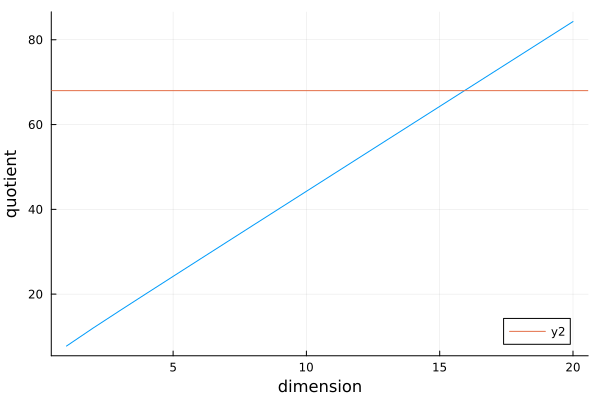
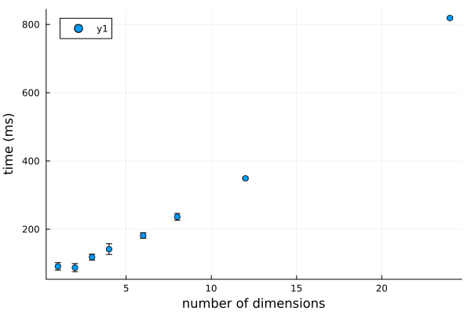

# Scaling
Let us look at the code for the laplace operator and count the number of read and write operations and float and iteger operations. This should give us an idea if the code is compute or memory bound.
The function that computes the coordinate of a given index looks like this:

```c++
static inline __device__ __host__ int index_to_cords(int index, int L, int d)
{
  for (int i = 0; i < d; i++)
  {
    index /= L;
  }
  return index % L;
}
```
it does `d` divisions and one modulo operation. 
In assembly it looks like this (using https://godbolt.org/ and compiling with -O3 on gcc 14.2 x86-64):

```
index_to_cords(int, int, int):
        mov     eax, edi
        mov     edi, edx
        test    edx, edx
        jle     .L2
        xor     ecx, ecx
.L3:
        cdq
        add     ecx, 1
        idiv    esi
        cmp     edi, ecx
        jne     .L3
.L2:
        cdq
        idiv    esi
        mov     eax, edx
        ret
```
for the remainder of this analysis I assume that the general structure of the assembly code (number of integer/float/read/write operations) is the same for cpu and gpu code.
Where `idiv` are integer divisions. The `idev` instruction computes the division and the remainder, so `mov     eax, edx` stores the quotient in `eax` and the remainder in `edx`. There is no read or write from the main memory in this code, because `eax`, `edi` etc. are registers on the cpu. 

So in total we have 

1. `test    edx, edx`    → Logical AND (1 integer operation)
2. `xor     ecx, ecx`    → Logical XOR (1 integer operation)
3. `cdq`                → Sign extend (1 integer operation in `.L3`)
4. `add     ecx, 1`      → Addition (1 integer operation)
5. `idiv    esi`         → Integer division (1 integer operation in `.L3`)
6. `cmp     edi, ecx`    → Compare (1 integer operation)
7. `cdq`                → Sign extend (1 integer operation in `.L2`)
8. `idiv    esi`         → Integer division (1 integer operation in `.L2`)

which gives 4 operations in .L3, 2 in .L2 which is 6 operations per itteration of the loop and 2 operations outside. Giving us $6d + 2$ operations in total.


The next function we need to look at is the neighbour index function:
```cpp
extern "C" __host__ __device__ int neighbour_index_gpu(int ind, int direction,
                                                       int amount, int L, int d,
                                                       int N, int index_mode)
{
  // should be consistant with cpu code
  int cord = index_to_cords(ind, L, direction);
  cord += amount;
  if (/*cord > L || cord < 0 ||*/ cord == -1 || cord == L)
    return N;

  // if on boundary => return 0 through special index
  assert(amount == 1 || amount == -1 || amount == 0);
  int n = 1;
  for (int i = 0; i < direction; i++)
  {
    n *= L;
  }
  ind += amount * n;

  return ind;
}
```

ignoring the boundary checking, which should only relevant for a small part of the domain, we get:
```cpp
int neighbour_index_gpu(int ind, int direction,
                                                       int amount, int L, int d,
                                                       int N, int index_mode)
{
  // should be consistant with cpu code
  int cord = index_to_cords(ind, L, direction);
  cord += amount;
  int n = 1;
  for (int i = 0; i < direction; i++)
  {
    n *= L;
  }
  ind += amount * n;
  return ind;
}
```

which is this assembly code 
```asm
neighbour_index_gpu(int, int, int, int, int, int, int):
        test    esi, esi        ; Logical AND (integer operation)
        jle     .L7             ; Jump
        xor     r9d, r9d        ; Clear r9d (integer operation)
        mov     r8d, 1          ; Move
        test    sil, 1          ; Logical AND (integer operation)
        je      .L8             ; Jump
        mov     r8d, ecx        ; Move
        mov     r9d, 1          ; Move
        cmp     esi, 1          ; Compare (integer operation)
        je      .L15            ; Jump
.L8:
        imul    r8d, ecx        ; Integer multiplication (integer operation)
        add     r9d, 2          ; Addition (integer operation)
        imul    r8d, ecx        ; Integer multiplication (integer operation)
        cmp     esi, r9d        ; Compare (integer operation)
        jne     .L8             ; Jump
.L15:
        imul    edx, r8d        ; Integer multiplication (integer operation)
.L7:
        lea     eax, [rdi+rdx]  ; Address calculation (integer operation)
        ret                     ; Return
```

which gives us 4 operations inside .L8, 1 operation in .L15 and and 1 operation in L7.

I think that L8 is executed `direction` times and the others once, which gives us `4*direction+2+4` operations.

So in total in these two functions there are `12 direction + 8` operations.

```cpp
__global__ void laplace_gpu(float *ddf, float *u, int d, int L, int N,
                            unsigned int index_mode)
{
  int ind = blockIdx.x * blockDim.x + threadIdx.x; // 1 fused ioperation
  if (ind < N) // 1 iop
  {
    float laplace_value = 0;
    for (int i = 0; i < d; i++) // loop d times, 2 iops
    {
      laplace_value += -u[neighbour_index_gpu(ind, i, 1, L, d, N, index_mode)] + 2 * u[neighbour_index_gpu(ind, i, 0, L, d, N, index_mode)] - u[neighbour_index_gpu(ind, i, -1, L, d, N, index_mode)]; // 4 * (12d+8) iops + 3 flops + 3 reads
    }
    // the discrete version is defined without dx
    ddf[ind] = laplace_value; // 1 write
  }
}
```

in order to be able to compile it with gcc I slightly change the function signature to `void laplace_gpu(float *ddf, float *u, int d, int L, int N, unsigned int index_mode, int ind)`. This gives a rather long assembly code which can be found in `figs/C++-x86-64 gcc 14.2-1.asm`.
This has 3d reads, d writes and 3d floating point operations as well as 2 + 2d integer operations.

Based on the line by line analysis of the code, this gives in total
$$
\begin{align}
	2+ d(2+6d + 2+12d+8)  & = 2+ 12d + 18d^2  \qquad & \text{integer operations} \\
 3d  &  & \text{floating point operations} \\
3d &  & \text{reads} \\
1 &  & \text{write}
\end{align}
$$

## Information on the Used device and theoretical upper limit of performance
For estimating the ideal performance, we can look at the [datasheet provided by nvidia](https://www.nvidia.com/content/dam/en-zz/Solutions/design-visualization/quadro-product-literature/quadro-rtx-4000-datasheet.pdf) which notes a single precision performance of 7.1 TFLOPs and memory bandwidth of 416 GB/s.

with a 32 bit performance this gives a ratio of 
```
(7.1 × (10^12)) / 416000000000 ≈ 17
```
<!-- 
therefore the dimension vs quotient analysis looks like this


which suggests that this approach is memory bound for dimensions lower than 15 and compute bound for larger than 15.




Code performance scaling over number of dimensions while keeping the total number of sites the same. This is achieved by picking a highly compositible number $n$ so that a grid with the size of $2^n$ can still be fit on the memory in the gpu ($n<30$) in this case 24 which has a lot of divisors (1, 2, 3, 4, 6, 8, 12, 24).  -->
